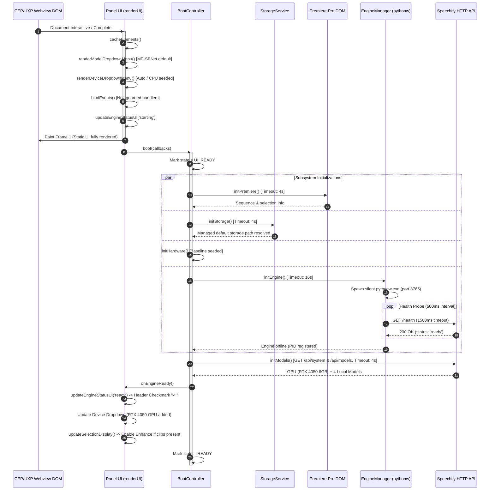

# Speechify Boot Architecture & Lifecycle Guide

## 1. Overview & Core Directives

The Speechify boot architecture is built on a fundamental invariant: **the user interface renders synchronously and immediately on panel load, completely decoupled from all backend, filesystem, and host-application asynchronous initializations.**

No service initialization—including python daemon spawning, model directory scanning, hardware discovery, or Premiere Pro ExtendScript evaluations—can ever block, freeze, or prevent UI rendering.

```
PLUGIN LOAD
     │
     ▼
RENDER STATIC UI  ──► [100% Paint Complete; Header: "Starting…"; Buttons & Dropdowns Interactive]
     │
     ▼
ASYNC INITIALIZATION (SpeechifyBootController)
     ├── Premiere State Sync  (Timeout: 4s)
     ├── Storage Resolution   (Timeout: 4s, Managed Default)
     ├── Hardware Baseline    (Timeout: 3s, Auto + CPU)
     └── Engine Startup       (Timeout: 16s, Windowless pythonw)
           │
           ▼ (Once Engine Healthy)
     Model Discovery & GPU Inspection (Timeout: 4s)
           │
           ▼
READY STATE ──► [Header: Subtle Checkmark "✓"; Enhance Button Active if clips selected]
```

---

## 2. Phased Boot Order



---

## 3. Subsystem Timeout & Isolation Matrix

Every operation in Speechify has a hard timeout limit. If any subsystem fails or times out, the failure is contained, logged to `logs/boot.log`, and the rest of the application remains fully functional.

| Subsystem | Service Name | Hard Timeout | Fallback Behavior on Failure / Timeout | Permanent Loading Prevention |
| :--- | :--- | :--- | :--- | :--- |
| **Static UI Render** | `ui` | None (Sync) | Renders markup, seeds dropdowns, attaches null-guarded events. | Rendered on frame 1 before async calls. |
| **Premiere Timeline** | `premiere` | **4.0 seconds** | `evalScript` capped at 3.5s. Shows "No sequence open" if timed out. | UI remains interactive; auto-polls later. |
| **Model Storage** | `storage` | **4.0 seconds** | Immediately defaults to managed path (`models/storage`). Never blank. | Dropdown shows installed count or managed label. |
| **Hardware Detection** | `hardware` | **3.0 seconds** | Seeds with `Automatic (Recommended)` and `CPU — System Processor`. | Never stays stuck in "Detecting...". |
| **Engine Daemon** | `engine` | **16.0 seconds** | Internal health timeout at 15s. On timeout, header displays minimal `!` and `[ Retry ]`. | Never hangs in infinite "Starting…". |
| **Model Discovery** | `models` | **4.0 seconds** | Shows default metadata for all 4 supported neural models. | Download buttons remain functional in Settings. |

---

## 4. Subsystem State Machine

Each subsystem tracks three authoritative states:
- `starting` / `pending`: Initializing within its allotted timeout window.
- `ready`: Initialized successfully and healthy.
- `error`: Failed or timed out. Handled gracefully without propagating errors to other systems.

### Application Root States:
- `BOOTING`: Script evaluation and initial mount.
- `UI_READY`: Initial DOM elements cached and painted.
- `SERVICES_STARTING`: Parallel async tasks running.
- `ENGINE_READY`: Local python daemon confirmed healthy over HTTP `/health`.
- `READY`: All services initialized, GPU detected, models listed.
- `PARTIAL_ERROR`: Engine or other subsystem timed out. UI is fully functional with clear retry affordance.

---

## 5. Elimination of Root Causes

### 1. Black Screen / Vertical Blue Lines (CEF DirectX Composite Stalls)
- **Previous Cause:** The panel blocked the initial paint while `await`ing engine health checks and timeline queries. If an uncaught promise rejected or if `DOMContentLoaded` had already fired, Chromium Embedded Framework failed to present the render buffer, showing corrupted GPU swapchains.
- **Resolution:**
  1. Top-level `window.onerror` and `window.onunhandledrejection` handlers prevent silent runtime death.
  2. `renderUI()` executes synchronously.
  3. `document.readyState` check ensures initialization runs regardless of whether `DOMContentLoaded` already occurred.
  4. Design system CSS sheets are linked explicitly in `<head>` without dynamic `@import` resolution stalls.

### 2. AppState Circular Recursion & Stack Overflow
- **Previous Cause:** `updateEngineStatusUI` dispatched mutations to `AppState`, which notified subscribers, which invoked `updateEngineStatusUI` in an infinite loop.
- **Resolution:**
  1. `updateEngineStatusUI` is a pure DOM rendering function; it never dispatches back to `AppState`.
  2. `AppState._notify` contains a re-entrancy guard `this._notifyingSlices` that immediately drops re-entrant notifications on the same slice.
  3. Setters perform strict value equality comparisons before notifying listeners.

### 3. Infinite "Starting…" & "Detecting…"
- **Previous Cause:** `fetch(`${state.engineUrl}/health`)` and ExtendScript `csInterface.evalScript` had no `AbortController` or callback timeout.
- **Resolution:**
  1. Every `fetch` uses `AbortController` with explicit timeouts (1500ms for health, 3000ms for models/system).
  2. ExtendScript `evalScript` is wrapped with a 3500ms timeout promise.
  3. `BootController.runService()` bounds all tasks with a hard promise race timeout.

### 4. Visible PowerShell / Console Window
- **Previous Cause:** Legacy `.bat` launching or unhidden process spawning.
- **Resolution:**
  1. PathManager prioritizes `pythonw.exe` over `python.exe` on Windows.
  2. `child_process.spawn` uses `windowsHide: true`, `detached: true`, and redirects `stdio` to `logs/engine.log`.
  3. Validated via `test_lifecycle_spawn.js`: `MainWindowHandle: 0` and empty title.

---

## 6. Developer Diagnostics & Logging

All boot lifecycle events are logged to persistent files:
- `logs/boot.log`: Chronological startup milestones, service timings, and timeout errors.
- `logs/engine.log`: Python daemon stdout/stderr streams.
- `logs/engine_startup.log`: Timestamped process spawn arguments and PID tracking.

### Interactive Console Inspection:
Developers can query application health at any time in the panel DevTools console:

```javascript
window.SpeechifyBootController.getStatus();
// Output:
// {
//   state: "READY",
//   services: {
//     ui: { status: "ready", error: null },
//     premiere: { status: "ready", error: null },
//     storage: { status: "ready", error: null },
//     hardware: { status: "ready", error: null },
//     engine: { status: "ready", error: null },
//     models: { status: "ready", error: null }
//   }
// }
```
