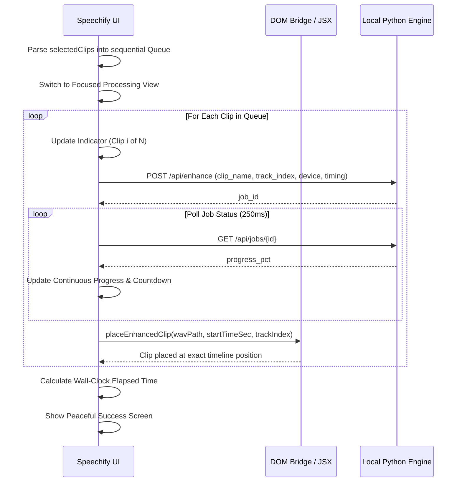

# Speechify — State Architecture & Synchronization

## 1. Overview

Speechify connects Adobe Premiere Pro's CEP/UXP JavaScript environment to a local neural inference Python engine (`http://127.0.0.1:8765`). Maintaining responsive, calm, and accurate UI requires a robust state management system that prevents race conditions, handles timeline mutations passively, and tracks job states deterministically.

---

## 2. Core State Schema

The panel maintains a single, central state store in `plugin/index.js`:

```javascript
const state = {
  engineUrl: "http://127.0.0.1:8765",
  isEngineOnline: false,
  selectedModelId: "mp_senet",
  placementMode: "new_track",       // 'new_track' | 'replace' | 'project_only'
  scope: "selected_clips",          // 'selected_clips' | 'in_out' | 'entire_sequence'
  selectedDevice: "auto",           // 'auto' | 'cuda' | 'cpu'
  isCancelled: false,
  activeSequence: null,
  selectedClips: [],
  lastSyncedStateKey: "",           // Signature caching to avoid redundant DOM touching
  modelsList: {},
  storagePath: "",
  currentJobId: null,
  jobPollTimer: null,
  hardwareProfile: null,
  jobStartTime: 0
};
```

---

## 3. Timeline Synchronization & Passive Polling

### Safe Polling Mechanism
Premiere Pro does not provide a native push event for timeline selection changes. Speechify solves this using a non-blocking passive polling loop running every 800ms:

```javascript
setInterval(autoPollTimeline, 800);
window.addEventListener('focus', autoPollTimeline);
document.addEventListener('visibilitychange', () => {
  if (!document.hidden) autoPollTimeline();
});
```

### Signature Caching (State Debouncing)
To prevent constant UI re-rendering and DOM flicker, Speechify computes a composite state key:

$$\text{Key} = \text{SeqName} + \text{Duration} + \text{InPoint} + \text{OutPoint} + \text{ClipCount} + \sum (\text{ClipName} + \text{ClipDuration})$$

If the newly sampled signature equals `state.lastSyncedStateKey`, the sync operation aborts early with zero DOM interaction.

---

## 4. Multi-Clip Queue Flow

When the user triggers enhancement with multiple clips selected:



---

## 5. Error Recovery & Cancellation

1. **User Cancellation**: Clicking **Cancel** sets `state.isCancelled = true`, issues a POST request to `/api/jobs/{id}/cancel`, clears polling timers, and restores the main panel state without leaving orphan jobs or zombie files.
2. **Engine Unavailability**: If the engine daemon is offline, action buttons disable gracefully with an unobtrusive banner and a one-click restart trigger.
